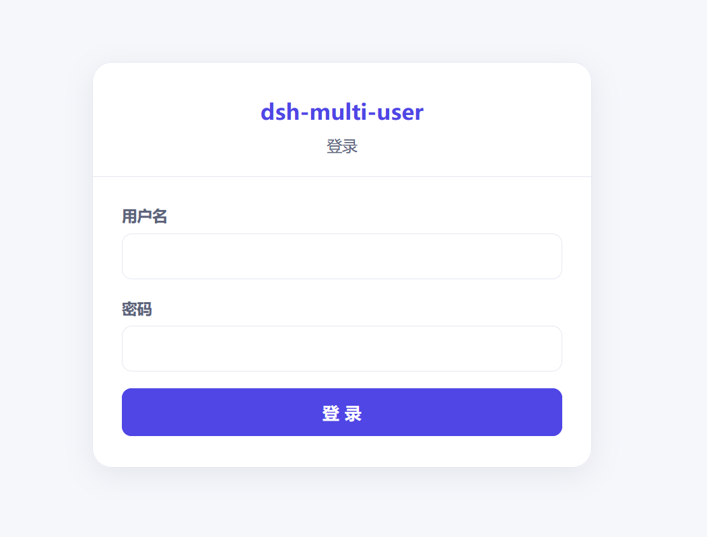
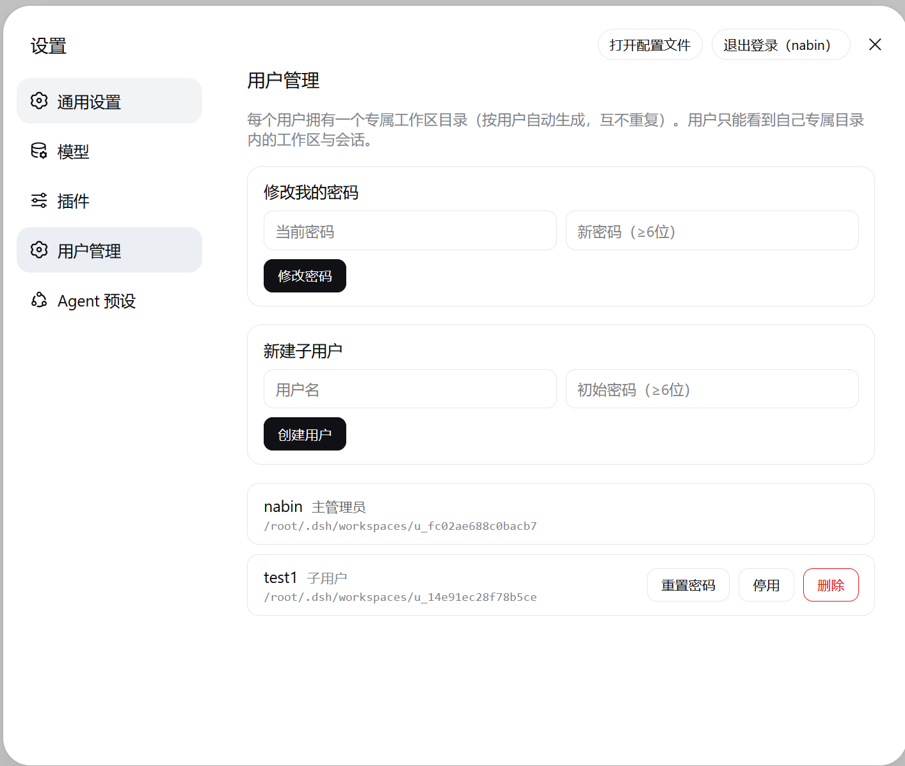

# dsh-multi-user

[](LICENSE)

[中文](README.md) | English

Single-process multi-user **workspace view partitioning** for the [DeepSeek Harness](https://github.com/deepseek-ai/deepseek-harness) Web GUI: a JWT login wall, per-user workspace/session filtering, and user management.

## Features

- **JWT login wall**: after mounting, visiting `/` first hits the login wall. With no owner set it shows an initialization page; otherwise a login page. On success the plugin self-signs a JWT into an HttpOnly cookie and redirects back to `/`.
- **Per-user workspace path list**: every user (including the owner) maintains a list of "joined" workspace paths. A user joins any path (e.g. `D:\Project\foo`) via the directory picker; only joined paths (and their sessions) are visible to that user, and other users do not see them.
- **User management**: the owner is set up via setup; other users are added in the settings "User Management" section; supports change password, disable/enable, delete.

> **Security boundary**: this is **view partitioning + lightweight login**, not isolation. All users in one process share the same `workspaceRegistry` / `sessionPersistence`; `userId` is only a display filter. Anyone with direct filesystem access to the host can see everything.

## Architecture

```
Browser ──► dsh web (127.0.0.1:3080)
             │
             ├─ Host entry src/host/index.ts: login wall (webServer route) + user mgmt API + JWT signing + workspace path list
             ├─ Client entry src/client/index.ts: identity via /api/mu/me/grants + filter workspaces by per-user path list
             └─ Data: $DSH_HOME/plugins-data/dsh-multi-user/ (user store + per-user path list)
```

Identity flow: **authentication calls the backend** (login wall + JWT signing + HttpOnly cookie); **partitioning does not re-verify** (the client fetches `/api/mu/me/grants` once for userId/role and `/api/mu/me/workspaces` for the user's joined path list — the browser carries the HttpOnly cookie automatically and the Host verifies it; the client filters workspaces by that list).

> **Design note**: the JWT lives in an **HttpOnly cookie** (invisible to `document.cookie`, avoiding XSS token theft). The client therefore does **not** read the cookie — it fetches `/api/mu/me/grants` for identity and `/api/mu/me/workspaces` for the path list.

> **Security boundary**: the per-user workspace path list is **view partitioning + a list convention**, not strong isolation. Agent tools (bash/file I/O) can still reach any host path; after uninstalling, `sidebar.workspaces` returns to the official full view. Real physical isolation requires multi-process / per-user data roots.

## Why a plugin (vs. a gateway)

There are two ways to share one dsh across multiple people: an **external gateway** (a separate reverse-proxy process in front of dsh that handles login and routing) and this project's **non-invasive plugin** form. The differences:

| Dimension | Gateway (e.g. the `dsh-server-deployment` family) | This plugin (non-invasive) |
|---|---|---|
| Deployment | A separate gateway process in front of dsh; dsh runs behind it | An ordinary plugin loaded into the dsh composition, peer to official plugins, no extra process |
| Install/restore | Extra config, TLS, port mapping and process supervision to maintain; removing it means tearing down a whole layer | One `dsh plugin add/remove`; uninstalling restores the official full view |
| Invasiveness | Intercepts at the network-topology layer; dsh itself is unaware of multi-user | Only uses plugin extension points (login-wall route + `sidebar.workspaces` filtering), no kernel patch |
| Identity | Gateway reads the raw HTTP request to identify the user and injects identity | Host plugin self-signs a JWT into an HttpOnly cookie; the client self-checks via `/api/mu/*` |
| Upgrade | Gateway must track dsh versions and interface changes on its own | Upgrades with the plugin; works with dsh upgrades (peerDependencies declared) |
| Fit | Deployments needing real network-layer isolation, multi-host access, strong auth | Lightweight single-machine/single-process multi-user partitioning, out of the box |

**Why not the heavier gateway approach**:

1. **dsh's core principle is "everything is a plugin"** — a login wall can be a UI-layer plugin, and the workspace list can be filtered through the `sidebar.workspaces` extension point, with no reverse proxy layered outside dsh. A gateway puts "multi-user" at the network layer; a plugin puts it back into dsh's own extension points, matching the shape of official components.
2. **Zero-cost install/restore**: a gateway means maintaining a reverse proxy (config, TLS, ports, process supervision) and tearing it all down on uninstall; a plugin is a single `dsh plugin add/remove`, and after removal `sidebar.workspaces` returns to the official occupant with behavior identical to before install.
3. **No network-layer isolation needed here**: this plugin targets "multi-user **view partitioning + lightweight login**" on one machine, not strong multi-tenant isolation (see the security boundary above). When real network-layer isolation, multi-host access, or strong auth is required, a gateway / multi-process approach is the right tool — that is out of scope here.

> In short: **a gateway answers "who can connect to this dsh"; this plugin answers "what each person sees once connected"**. For lightweight single-machine multi-user partitioning, the plugin form is lighter, more reversible, and fits the dsh ecosystem better.

## Install

```bash
# via npm
npx @deepseek-ai/dsh plugin --profile web add dsh-multi-user

# from GitHub
npx @deepseek-ai/dsh plugin --profile web add github:nabin-qq273274877/dsh-multi-user

# local dev (link)
npx @deepseek-ai/dsh plugin --profile web add link:/path/to/dsh-multi-user
```

Then restart `dsh web` and refresh the page. The Host row is auto-mounted via `dsh.bundle.patch`, and the Client half is scanned into `window.__DSH_BOOT__` via the `dsh.client` field — no manual `cordis.patch.yml` edits required.

Or just copy the following prompt to an AI:

```
Please install the dsh-multi-user plugin. Repo: https://github.com/nabin-qq273274877/dsh-multi-user
Follow the README to install and configure it.
```

Then restart `dsh web` and refresh the page.

## Screenshots

<p align="center"></p>

<p align="center"></p>

## Uninstall

```bash
npx @deepseek-ai/dsh plugin --profile web remove dsh-multi-user
```

After removal `sidebar.workspaces` returns to the official occupant and the full view is restored; plugin data (`$DSH_HOME/plugins-data/dsh-multi-user/`) is retained.

## First use

1. Visit `http://127.0.0.1:3080/` → the initialization page appears; set the owner (auto-logged in into DSH).
2. The owner adds sub-users in the settings "User Management" section.
3. Each user clicks "New workspace" in the sidebar and picks a directory (native OS dialog on Windows/macOS, in-app browser on container/headless Linux); the picked path is "joined" into that user's workspace list, visible only to them.

## HTTP API

| Method | Path | Description |
|---|---|---|
| POST | `/api/mu/auth/password` | Password login (writes JWT cookie on success) |
| POST | `/api/mu/auth/logout` | Logout (clears cookie) |
| GET | `/api/mu/auth/me` | Current identity |
| GET | `/api/mu/public/config` | Public config (lifecycle state) |
| POST | `/api/mu/admin/owner` | Initialize owner (fresh state, auto-login) |
| GET | `/api/mu/me/grants` | Current user identity (userId/role) |
| GET | `/api/mu/me/workspaces` | Current user's joined workspace path list |
| POST | `/api/mu/me/workspaces` | Join a path to the current user's list (body: `{path}`) |
| POST | `/api/mu/me/workspaces/delete` | Remove a path from the current user's list (body: `{path}`) |
| POST | `/api/mu/me/password` | Change own password |
| GET/POST | `/api/mu/admin/users` | List / create sub-users |
| POST | `/api/mu/admin/users/update` | Update user (status/display name) |
| POST | `/api/mu/admin/users/reset-password` | Reset a sub-user's password |
| POST | `/api/mu/admin/users/delete` | Delete user (account disabled, path list retained) |

## Data storage

```
$DSH_HOME/plugins-data/dsh-multi-user/
├─ .jwt-secret            # JWT HMAC secret (0600, auto-generated)
├─ settings.json          # plugin settings (ownerUserId / auth)
├─ users.json             # user store (scrypt salted password hashes)
└─ tenants/<uid>/grants.json  # user → workspaceRoot + workspacePaths (joined path list)
```

`workspacePaths` is each user's "joined workspace path" list, used as the sidebar view-partitioning source; workspace records themselves are written to the native `workspaceRegistry` (`ctx.workspaces.create`). Uninstalling restores the full view.

## Development

```bash
git clone https://github.com/nabin-qq273274877/dsh-multi-user.git
cd dsh-multi-user
pnpm install
pnpm run build      # esbuild bundles to lib/

# link into a DSH profile for live testing
npx @deepseek-ai/dsh plugin --profile web add link:$(pwd)
```

## Project structure

```
src/
├─ types.ts              # shared type definitions
├─ jwt.ts                # JWT sign/verify (HMAC-SHA256, zero deps)
├─ store.ts              # data store façade (scrypt + atomic JSON writes)
├─ lifecycle.ts          # fresh / admin-set state machine
├─ host/
│  └─ index.ts           # host plugin: login wall route + user mgmt API + workspace path list API
└─ client/
   └─ index.ts           # client plugin: identity + path-list filtering + directory picker (native/browse dual backend)
scripts/
└─ build.ts              # esbuild: host ESM + client factory bundle
```

## License

[MIT](LICENSE)
